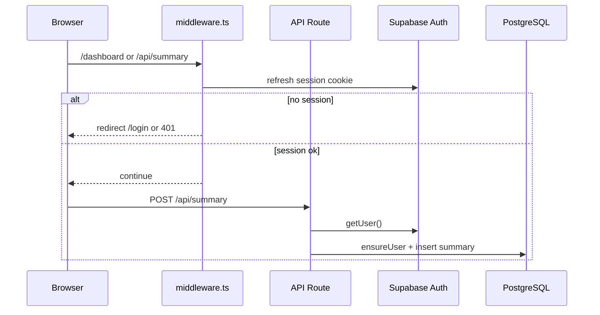

# Epic 3 개발 플랜 — 인증 및 계정 관리 (히스토리)

| 항목 | 내용 |
|------|------|
| **상태** | `in_progress` (Story 3.1 완료) |
| **작성일** | 2026-06-03 |
| **예상 기간** | 2~3일 (크레딧 차감 포함 시 +0.5~1일) |
| **PRD** | [docusumm-prd.md](../prd/docusumm-prd.md) — Epic 3 |
| **Tech Spec** | [docusumm-tech-spec.md](../tech-spec/docusumm-tech-spec.md) — 단계 3 |

---

## 1. 목표

Supabase Auth(Google OAuth)로 사용자를 식별하고, Epic 2의 `DEV_USER_ID` 임시 방식을 제거한다. 로그인한 사용자만 대시보드·요약 API를 사용하며, **본인 요약 히스토리만** 조회·생성할 수 있게 한다.

### 성공 기준 (Epic Done)

- [ ] Google 로그인/로그아웃 E2E 동작
- [ ] 비로그인 → `/dashboard`, `/api/summary` 차단
- [ ] `public.users` 생성 + 신규 가입 `credits = 3`
- [ ] 사이드바 히스토리 = DB 실데이터 (Mock fallback 없음)
- [ ] 타 사용자 summary ID 접근 불가
- [ ] `getDevUserId()` 프로덕션 경로에서 제거

### 범위 밖 (Epic 4·5)

- Stripe 결제·웹훅 충전 (FR011~012)
- Resend 이메일 알림 (FR009~010)
- DB RLS 정책 (2단계, 선택)

---

## 2. 선행 조건 체크리스트

### 인프라 (완료 가정)

- [x] Google Cloud Console — OAuth 클라이언트 생성
- [x] Supabase — Authentication → Google Provider 활성화
- [ ] Supabase — URL Configuration (로컬/프로덕션 redirect)

### 코드베이스 (Epic 1·2·6)

- [x] `/dashboard` UI, `HistorySidebar`, `InputPanel`, `SummaryCard`
- [x] `POST/GET /api/summary`, `GET /api/summary/[id]`, polling
- [x] Drizzle `summaries` + `summary_options`, `schema_version`
- [ ] `.env.local`에 `NEXT_PUBLIC_SUPABASE_URL`, `NEXT_PUBLIC_SUPABASE_ANON_KEY` 추가

### Supabase Redirect URLs

| 환경 | Site URL | Redirect URL |
|------|----------|--------------|
| Local | `http://localhost:3002` | `http://localhost:3002/auth/callback` |
| Production (Vercel) | `https://docussum-orcin.vercel.app` | `https://docussum-orcin.vercel.app/auth/callback` |

→ 체크리스트: `docs/deploy/vercel-production.md`

---

## 3. 요구사항 매핑

| ID | 설명 | Story |
|----|------|-------|
| FR001 | Google 소셜 로그인 | 3.1 |
| FR002 | Protected Routes | 3.2 |
| FR003 | 가입 보너스 3 크레딧 | 3.3 |
| FR004 | 개인 히스토리 조회 | 3.3 |
| FR007 | 요약 1회 1 크레딧 | 3.3 (선택) |
| NFR001 | 데이터 사용자 격리 | 3.2, 3.3 |

---

## 4. 아키텍처 요약



**인증**: `@supabase/ssr` 쿠키 세션  
**DB**: 기존 `DATABASE_URL` + Drizzle (변경 없음)  
**격리**: 모든 쿼리 `WHERE user_id = session.user.id` (RLS는 Epic 3 필수 아님)

---

## 5. 스토리별 작업 플랜

### Story 3.1 — Supabase Auth + Google 로그인

**예상**: 0.5~1일 | **FR001**

#### Task 3.1.1 — 패키지·환경

- [x] `pnpm add @supabase/supabase-js @supabase/ssr` (`package.json` 반영 — 로컬에서 `pnpm install` 필요)
- [x] `.env.example` — `NEXT_PUBLIC_SUPABASE_*`
- [x] `next.config` — `lh3.googleusercontent.com` (Google 아바타)

#### Task 3.1.2 — Supabase 클라이언트

- [x] `lib/supabase/client.ts` — `createBrowserClient`
- [x] `lib/supabase/server.ts` — `createServerClient` + `cookies()`
- [x] `lib/supabase/middleware.ts` — `updateSession(request)` (3.2에서 연결)
- [x] `lib/supabase/env.ts`

#### Task 3.1.3 — OAuth 라우트

- [x] `app/auth/callback/route.ts` — `exchangeCodeForSession`, post-login redirect
- [x] `app/login/page.tsx`

#### Task 3.1.4 — UI

- [x] `components/auth/google-sign-in-button.tsx`
- [x] `components/auth/login-dialog.tsx`
- [x] `components/auth/auth-header.tsx`, `user-menu.tsx`
- [x] `app/dashboard/layout.tsx` — AuthHeader + 미로그인 CTA

#### Task 3.1.5 — 검증

- [ ] 로컬 Google 로그인 → Supabase `auth.users` 행 생성
- [ ] 로그아웃 → 쿠키 제거

---

### Story 3.2 — 보호 라우트 + API 인증

**예상**: 0.5~1일 | **FR002, NFR001**

#### Task 3.2.1 — Middleware

- [ ] 루트 `middleware.ts` 생성
- [ ] `config.matcher`: `/dashboard/:path*`, `/api/summary/:path*`
- [ ] 세션 없음: HTML → `/login?next={pathname}`, API → `401` JSON

#### Task 3.2.2 — 서버 Auth 헬퍼

- [ ] `lib/auth/errors.ts` — `AuthError`, `UNAUTHORIZED`
- [ ] `lib/auth/get-user.ts` — `getAuthUser()`, `requireAuthUser()`
- [ ] (선택) dev fallback: `ALLOW_DEV_USER` + `DEV_USER_ID`

#### Task 3.2.3 — API 교체

- [ ] `app/api/summary/route.ts` — `requireAuthUser()` 
- [ ] `app/api/summary/[id]/route.ts` — `requireAuthUser()` + `userId` 조건 유지

#### Task 3.2.4 — 클라이언트 401 처리

- [ ] `dashboard-client` — `fetch` 401 → `LoginDialog` open
- [ ] (선택) `sessionStorage`에 pending `{ sourceType, content, options }` 저장 → 로그인 후 재요청

#### Task 3.2.5 — `lib/dev-user.ts` 정리

- [ ] 프로덕션 빌드에서 `getDevUserId` 호출 경로 0건
- [ ] README 또는 주석에 deprecation 명시

#### Task 3.2.6 — 검증

- [ ] 시크릿 창 `/dashboard` → 로그인 유도
- [ ] `curl` 비인증 `POST /api/summary` → 401
- [ ] 사용자 A/B 교차 ID 접근 차단

---

### Story 3.3 — users 프로필 + 히스토리 + Mock 제거

**예상**: 1일 | **FR003, FR004** (+ 선택 FR007)

#### Task 3.3.1 — DB 스키마

- [ ] `db/schema.ts` — `users` 테이블 추가
- [ ] `summaries.userId` → `users.id` FK (migration)
- [ ] `db/migrations/003_epic3_users.sql` 또는 `pnpm db:push`
- [ ] 기존 `DEV_USER_ID` summaries 정리 (삭제 SQL 문서화)

```sql
-- db/migrations/003_epic3_users.sql (요지)
CREATE TABLE IF NOT EXISTS public.users (
  id UUID PRIMARY KEY,
  email TEXT NOT NULL,
  credits INTEGER NOT NULL DEFAULT 3,
  created_at TIMESTAMPTZ NOT NULL DEFAULT NOW()
);

ALTER TABLE public.summaries
  ADD CONSTRAINT summaries_user_id_users_id_fk
  FOREIGN KEY (user_id) REFERENCES public.users(id);
-- FK 추가 전 orphaned user_id 정리 필요
```

#### Task 3.3.2 — ensureUserProfile

- [ ] `lib/auth/ensure-user.ts`
- [ ] `requireAuthUser()` 내부에서 호출
- [ ] 신규 insert만 `credits = 3`, 기존 사용자 credits 유지

#### Task 3.3.3 — 대시보드 히스토리

- [ ] `dashboard-client` — `MOCK_HISTORY`, `MOCK_DETAILS` import 제거
- [ ] API 실패 시 빈 목록 + "로그인이 필요합니다" / "연결 오류" 구분
- [ ] 빈 히스토리 empty state (Story 1.2)

#### Task 3.3.4 — 계정 UI

- [ ] `components/auth/user-menu.tsx` — avatar/email, credits 표시, signOut
- [ ] `app/dashboard/layout.tsx` 헤더 통합

#### Task 3.3.5 — (선택) 히스토리 삭제

- [ ] `DELETE /api/summary/[id]` — 본인 row만

#### Task 3.3.6 — (선택) 크레딧 차감 FR007

- [ ] `credit_transactions` 테이블 (Epic 4와 공유 스키마)
- [ ] `POST /api/summary` 전 `credits >= 1`
- [ ] `process-summary` 완료 시 `credits -= 1`, transaction log
- [ ] `402` + `{ code: "INSUFFICIENT_CREDITS" }` — 충전 UI는 Epic 4 placeholder

#### Task 3.3.7 — 검증

- [ ] 신규 계정 `users.credits = 3`
- [ ] 요약 3건 후 (크레딧 포함 시) 4번째 402
- [ ] 사이드바 날짜 그룹 + 상세 로드

---

## 6. 파일 매니페스트

### 신규 생성

```
middleware.ts
lib/supabase/client.ts
lib/supabase/server.ts
lib/supabase/middleware.ts
lib/auth/get-user.ts
lib/auth/ensure-user.ts
lib/auth/errors.ts
app/auth/callback/route.ts
app/login/page.tsx                    # optional
components/auth/google-sign-in-button.tsx
components/auth/login-dialog.tsx
components/auth/user-menu.tsx
db/migrations/003_epic3_users.sql
```

### 수정

```
db/schema.ts
app/api/summary/route.ts
app/api/summary/[id]/route.ts
app/dashboard/dashboard-client.tsx
app/dashboard/layout.tsx
.env.example
lib/dev-user.ts                       # deprecated
docs/prd/docusumm-prd.md              # 체크박스 갱신 시
```

### 삭제·축소

```
lib/mock/history.ts                   # dashboard에서 미사용 (파일은 Storybook용으로 유지 가능)
```

---

## 7. 환경 변수

```env
# 필수 (Epic 3)
NEXT_PUBLIC_SUPABASE_URL=
NEXT_PUBLIC_SUPABASE_ANON_KEY=

# 기존 유지
DATABASE_URL=
GEMINI_API_KEY=
GEMINI_MODEL=gemini-2.5-flash

# 제거 대상 (Epic 3 완료 후)
# DEV_USER_ID=
# ALLOW_DEV_USER=
```

---

## 8. 구현 일정 (권장)

| Day | AM | PM |
|-----|----|----|
| **D1** | 3.1 패키지·클라이언트·callback | 3.1 로그인 UI + E2E 로그인 |
| **D2** | 3.2 middleware + get-user | 3.2 API 교체 + 401 UX |
| **D3** | 3.3 users 스키마·push | 3.3 Mock 제거·user-menu·회귀 테스트 |
| **D4** *(선택)* | 크레딧 차감·402 | PRD 체크박스·문서 완료 |

---

## 9. 테스트 플랜

### 9.1 인증

| # | 시나리오 | 기대 결과 |
|---|----------|-----------|
| T1 | 비로그인 `/dashboard` | `/login` 또는 로그인 모달 |
| T2 | Google 로그인 | `/dashboard`, session cookie |
| T3 | 로그아웃 후 API 호출 | 401 |
| T4 | callback 잘못된 code | 에러 페이지 또는 toast |

### 9.2 데이터 격리

| # | 시나리오 | 기대 결과 |
|---|----------|-----------|
| T5 | A가 요약 생성 | `summaries.user_id = A.id` |
| T6 | B가 A의 summary UUID GET | 404 |
| T7 | A 히스토리 목록 | A의 row만 |

### 9.3 프로필·크레딧

| # | 시나리오 | 기대 결과 |
|---|----------|-----------|
| T8 | 신규 가입 첫 API | `users` row, credits=3 |
| T9 | 재로그인 | credits 유지, 중복 row 없음 |
| T10 | (선택) 크레딧 0 요약 | 402 |

### 9.4 회귀 (Epic 2·6)

| # | 시나리오 | 기대 결과 |
|---|----------|-----------|
| T11 | 텍스트 요약 E2E | completed + v2 structured |
| T12 | YouTube 탭 요약 | fileUri 파이프라인 |
| T13 | polling 완료 toast | 히스토리 갱신 |

---

## 10. 리스크 및 결정

| 리스크 | 대응 |
|--------|------|
| `summaries`에 FK 없는 orphan `user_id` | migration 전 cleanup SQL 실행 |
| Middleware + Route Handler 세션 불일치 | `@supabase/ssr` 공식 패턴 그대로 사용 |
| 로그인 전 요약 시도 UX | `LoginDialog` + pending 요약 재개 (선택) |
| Drizzle postgres URL이 service role | 앱 레이어 `userId` 필터 필수 (RLS 미적용) |

### 확정 결정 (ADR 요지)

1. **Auth**: Supabase Auth + Google only (MVP)
2. **프로필 생성**: 앱 `ensureUserProfile` (DB trigger 미사용)
3. **DB 접근**: Drizzle + `DATABASE_URL` 유지 (Supabase client는 Auth 전용)
4. **크레딧 차감**: Epic 3 포함 여부는 구현 시작 전 팀 1회 결정

---

## 11. 완료 후 문서·코드 정리

- [ ] PRD Epic 3 수용 기준 체크박스 갱신
- [ ] Tech Spec 단계 3에 플랜 문서 링크 유지
- [ ] `.env.example`에서 `DEV_USER_ID` 제거 또는 주석 유지
- [ ] `docs/plan/epic-3-auth-plan.md` 상태 → `done` + 완료일 기록

---

## 12. 진행 기록

| 날짜 | Story | 메모 |
|------|-------|------|
| — | — | 구현 시작 전 |

---

## 부록 A — Cursor / Developer Agent 사용법

```
@.cursor/rules/agents/developer.mdc

PRD: @docs/prd/docusumm-prd.md (Epic 3)
Tech Spec: @docs/tech-spec/docusumm-tech-spec.md (단계 3)
플랜: @docs/plan/epic-3-auth-plan.md

Story 3.1부터 순서대로 구현해 주세요.
```

## 부록 B — 관련 코드 (현재, Epic 2)

| 파일 | Epic 3에서 할 일 |
|------|------------------|
| `lib/dev-user.ts` | → `requireAuthUser()` |
| `app/api/summary/route.ts` | userId 교체 |
| `app/dashboard/dashboard-client.tsx` | Mock 제거, 401 UX |
