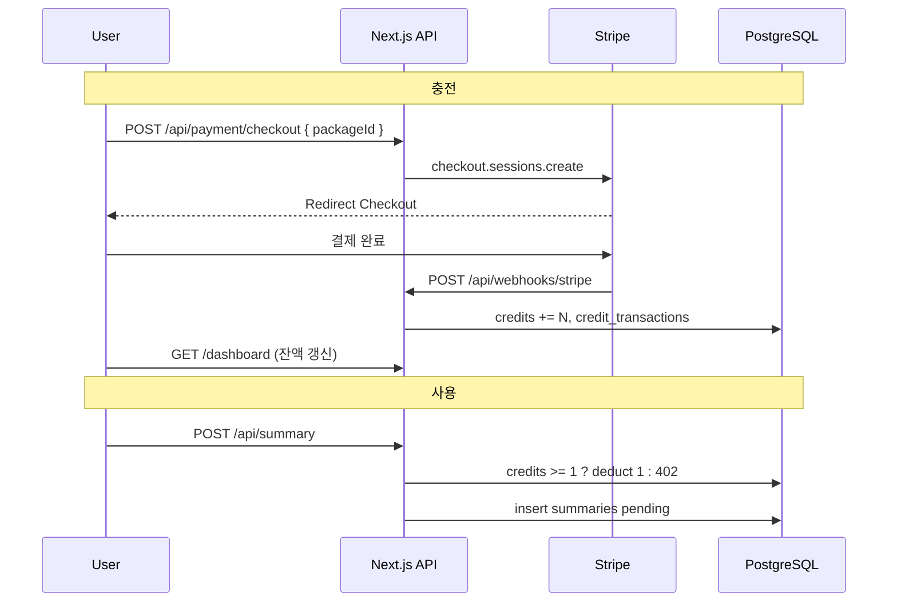

# Epic 4 개발 플랜 — 결제 시스템 (Stripe · 크레딧)

| 항목 | 내용 |
|------|------|
| **상태** | `planned` |
| **작성일** | 2026-06-03 |
| **예상 기간** | 3~4일 |
| **PRD** | [docusumm-prd.md](../prd/docusumm-prd.md) — Epic 4 |
| **Tech Spec** | [docusumm-tech-spec.md](../tech-spec/docusumm-tech-spec.md) — 단계 4 |
| **선행 Epic** | Epic 3 (로그인, `public.users`, `requireAuthUser`) |

---

## 1. 목표

Stripe Checkout으로 크레딧 패키지를 판매하고, Webhook으로 결제 완료 시 `users.credits`를 즉시 충전한다. 요약 API는 **1회당 1 크레딧**을 차감하며, 잔액이 없으면 요청을 거부하고 충전 UI로 유도한다 (FR007, FR011, FR012).

### 성공 기준 (Epic Done)

- [ ] 패키지 3종(30/$5, 50/$8, 100/$15) Checkout 결제 E2E (Stripe Test mode)
- [ ] `checkout.session.completed` Webhook → 크레딧 반영 + `credit_transactions` 기록
- [ ] Webhook 중복 수신 시 **이중 충전 없음** (idempotency)
- [ ] `POST /api/summary` — 크레딧 0이면 `402` + `INSUFFICIENT_CREDITS`
- [ ] 요약 1회 성공 플로우에서 크레딧 1 차감 (요청 시점 권장)
- [ ] 대시보드/헤더에 잔여 크레딧 표시
- [ ] Test / Live 키 환경 변수 분리 (NFR002)

### 범위 밖 (Epic 5·후순위)

- Resend 요약 완료 메일 (FR009~010)
- 환불·구독·쿠폰·세금/VAT 자동 계산
- 요약 `failed` 시 크레딧 자동 환불 (별도 정책 결정 후)
- Epic 7 채팅 크레딧 정책

---

## 2. 요구사항 매핑

| ID | 설명 | Story |
|----|------|-------|
| FR007 | 요약 1회 1 크레딧, 부족 시 거부 | 4.2 |
| FR011 | 30/50/100 크레딧 패키지 결제 | 4.1, 4.3 |
| FR012 | 결제 완료 즉시 크레딧 충전 | 4.4 |
| FR003 | 가입 보너스 3 크레딧 | Epic 3 (유지) |
| NFR002 | Stripe Test/Production 키 분리 | 4.1 |

### 사용자 여정 2 (PRD)

1. 무료 3크레딧 소진 → 요약 시도  
2. **크레딧 부족 모달** → 충전하기  
3. **결제 페이지**에서 패키지 선택 → Stripe Checkout  
4. 성공 → 크레딧 즉시 반영 → 요약 재시도  

---

## 3. 현재 코드 갭

| 항목 | 현재 | Epic 4 후 |
|------|------|-----------|
| `users.credits` | 컬럼만 존재, UI 미표시 | 헤더·결제 페이지 표시 |
| `credit_transactions` | **스키마 없음** | Drizzle + 마이그레이션 |
| 요약 API | 크레딧 검사/차감 **없음** | POST 시 차감 또는 선차감 |
| Stripe | 코드·패키지 **없음** | Checkout + Webhook |
| 결제 UI | `components/payment/` **없음** | 패키지 카드·부족 모달 |
| `proxy.ts` | summary 보호만 | Webhook 경로 인증 제외 |

---

## 4. 아키텍처



### 설계 결정 (ADR)

| 주제 | 결정 |
|------|------|
| 결제 방식 | **Stripe Checkout** (Hosted) — MVP 최소 UI |
| 가격 정의 | **Stripe MCP** `create_product` / `create_price` → env (`STRIPE_PRICE_ID_*`). 카탈로그: [test-mode-catalog.md](../stripe/test-mode-catalog.md) |
| 차감 시점 | **요약 요청(POST) 직후·Gemini 호출 전** 1 차감 (실패 환불은 v2) |
| 원장 | `credit_transactions` 모든 증감 기록 (`bonus`/`charge`/`usage`) |
| Webhook 멱등 | `stripe_checkout_session_id` UNIQUE 또는 `stripe_event_id` UNIQUE |
| Webhook 인증 | `stripe.webhooks.constructEvent` 서명 검증 필수 |
| DB 트랜잭션 | `deductCredit` / `addCredits`는 Drizzle transaction |

---

## 5. 크레딧 패키지 (고정)

| `packageId` | 크레딧 | 가격 (USD) | Stripe Price (env) |
|-------------|--------|------------|---------------------|
| `credits_30` | 30 | $5.00 | `STRIPE_PRICE_ID_30` |
| `credits_50` | 50 | $8.00 | `STRIPE_PRICE_ID_50` |
| `credits_100` | 100 | $15.00 | `STRIPE_PRICE_ID_100` |

```typescript
// lib/credits/packages.ts (예시)
export const CREDIT_PACKAGES = [
  { id: "credits_30", credits: 30, label: "30회", priceUsd: 5 },
  { id: "credits_50", credits: 50, label: "50회", priceUsd: 8 },
  { id: "credits_100", credits: 100, label: "100회", priceUsd: 15 },
] as const;
```

Checkout `metadata`: `{ userId, packageId, credits }` — Webhook에서 검증.

---

## 6. DB 스키마 확장

### 6.1 `credit_transactions`

```typescript
export const creditTransactionTypeEnum = pgEnum("credit_transaction_type", [
  "bonus",   // 가입 보너스 (Epic 3)
  "charge",  // Stripe 충전
  "usage",   // 요약 사용
]);

export const creditTransactions = pgTable("credit_transactions", {
  id: uuid("id").defaultRandom().primaryKey(),
  userId: uuid("user_id").notNull().references(() => users.id),
  amount: integer("amount").notNull(), // +충전, -사용
  type: creditTransactionTypeEnum("type").notNull(),
  stripeCheckoutSessionId: text("stripe_checkout_session_id"),
  stripeEventId: text("stripe_event_id"),
  note: text("note"),
  createdAt: timestamp("created_at", { withTimezone: true }).notNull().defaultNow(),
});
```

**인덱스·제약**

- `UNIQUE(stripe_checkout_session_id)` WHERE NOT NULL
- `UNIQUE(stripe_event_id)` WHERE NOT NULL
- `(user_id, created_at DESC)` 인덱스

### 6.2 마이그레이션

- `db/migrations/004_epic4_credit_transactions.sql`
- `pnpm db:push`

---

## 7. 스토리별 작업 플랜

### Story 4.1 — 크레딧 도메인 · 패키지 · 환경 설정

**예상**: 0.5~1일 | **FR011, NFR002**

#### Task 4.1.1 — Stripe·패키지

- [ ] `pnpm add stripe`
- [ ] `lib/stripe/client.ts` — `STRIPE_SECRET_KEY` 서버 전용
- [ ] `lib/credits/packages.ts` — 패키지 상수·검증
- [ ] `.env.example` 확장

```env
STRIPE_SECRET_KEY=sk_test_...
STRIPE_WEBHOOK_SECRET=whsec_...
NEXT_PUBLIC_STRIPE_PUBLISHABLE_KEY=pk_test_...  # optional
STRIPE_PRICE_ID_30=price_...
STRIPE_PRICE_ID_50=price_...
STRIPE_PRICE_ID_100=price_...
```

#### Task 4.1.2 — DB

- [ ] `credit_transactions` Drizzle 스키마
- [ ] `lib/credits/ledger.ts` — `addCredits`, `deductCredit`, `getBalance`

```typescript
// addCredits(userId, amount, type, meta) — transaction
// deductCredit(userId, 1) — UPDATE ... WHERE credits >= 1 RETURNING
```

#### Task 4.1.3 — Stripe 상품 등록 (Stripe MCP)

- [x] Cursor **Stripe MCP** (`stripe` → `https://mcp.stripe.com`) OAuth 연결
- [x] `create_product` ×3 + `create_price` ×3 (one-time, USD 센트: 500 / 800 / 1500)
- [x] Price ID를 [docs/stripe/test-mode-catalog.md](../stripe/test-mode-catalog.md)에 기록
- [ ] `.env.local`에 `STRIPE_PRICE_ID_30|50|100` 반영 (카탈로그 참고)
- [ ] Stripe Dashboard에서 **Test mode API 키** 발급 → `STRIPE_SECRET_KEY`, `NEXT_PUBLIC_STRIPE_PUBLISHABLE_KEY`
- [ ] 로컬: [Stripe CLI](https://stripe.com/docs/stripe-cli) `stripe listen --forward-to localhost:3002/api/webhooks/stripe`

**MCP 워크플로우 (재등록 시)**

1. `search_stripe_resources` — `products:name~"DocuSumm"` 로 기존 여부 확인
2. 없으면 `create_product` → `create_price` (product ID, `unit_amount`, `currency: usd`)
3. 생성된 `price_...` 를 env 및 카탈로그 문서에 갱신

**수용 기준**

- [ ] `getBalance(userId)`가 `users.credits` 반환
- [ ] `addCredits` / `deductCredit` 단위 테스트 또는 수동 SQL 확인

---

### Story 4.2 — 요약 시 크레딧 차감 · 부족 시 402 (FR007)

**예상**: 0.5일

#### Task 4.2.1 — API

- [ ] `POST /api/summary` — `deductCredit(userId, 1)` **insert 전**
- [ ] 실패 시 `402` + `{ code: "INSUFFICIENT_CREDITS", credits: 0 }`
- [ ] 성공 시 `credit_transactions` type `usage`, amount `-1`
- [ ] `process-summary` **failed** 시 환불 여부: MVP는 **미환불** (문서화)

#### Task 4.2.2 — UI

- [ ] `components/payment/insufficient-credits-dialog.tsx`
- [ ] `dashboard-client` — 402 응답 시 모달 + `/billing` 링크
- [ ] `AuthHeader` 또는 사이드바 — **잔여 크레딧** 배지

**수용 기준**

- [ ] 크레딧 0 → 요약 불가 + 모달
- [ ] 크레딧 3 → 요약 3회 후 402

---

### Story 4.3 — Stripe Checkout · 결제 페이지 (FR011)

**예상**: 1일

#### Task 4.3.1 — API

- [ ] `POST /api/payment/checkout` — body `{ packageId }`
- [ ] `requireAuthUser()` + 패키지 검증
- [ ] `stripe.checkout.sessions.create`:
  - `mode: 'payment'`
  - `line_items: [{ price: STRIPE_PRICE_ID_*, quantity: 1 }]`
  - `success_url: {origin}/billing?success=1`
  - `cancel_url: {origin}/billing?canceled=1`
  - `client_reference_id: userId`
  - `metadata: { userId, packageId, credits }`

#### Task 4.3.2 — UI

- [ ] `app/billing/page.tsx` (또는 `/dashboard/billing`)
- [ ] `components/payment/credit-package-card.tsx` × 3
- [ ] 결제 버튼 → Checkout URL redirect
- [ ] success/canceled 쿼리 토스트

#### Task 4.3.3 — proxy

- [ ] `/api/webhooks/stripe` — **인증 제외** (matcher 또는 handler 공개)
- [ ] `/billing` — 로그인 필요 (기존 proxy 유지)

**수용 기준**

- [ ] Test 카드 `4242 4242 4242 4242`로 Checkout 완료
- [ ] success URL 복귀 (크레딧은 Webhook 후 반영 — 로딩 안내)

---

### Story 4.4 — Stripe Webhook · 즉시 충전 (FR012)

**예상**: 1일

#### Task 4.4.1 — Webhook Route

- [ ] `app/api/webhooks/stripe/route.ts`
- [ ] `export const runtime = 'nodejs'` (raw body 필요)
- [ ] `request.text()` + `stripe.webhooks.constructEvent`
- [ ] 처리 이벤트: `checkout.session.completed` (필수), `checkout.session.async_payment_succeeded` (선택)

#### Task 4.4.2 — 충전 로직

- [ ] `metadata.userId`, `metadata.credits` 검증
- [ ] `client_reference_id === userId` 교차 검증
- [ ] `addCredits(userId, credits, 'charge', { sessionId, eventId })`
- [ ] 이미 처리된 `session.id` → 200 OK (skip)

#### Task 4.4.3 — 운영

- [ ] Stripe Dashboard → Webhook endpoint 등록 (배포 URL)
- [ ] 로컬: Stripe CLI forwarding 문서화

**수용 기준**

- [ ] 결제 후 10초 내 `users.credits` 증가
- [ ] `credit_transactions`에 `type=charge`, `amount=+N`
- [ ] 동일 이벤트 2회 전송 → 크레딧 1회만 증가

---

## 8. 파일 매니페스트

### 신규

```
lib/stripe/client.ts
lib/credits/packages.ts
lib/credits/ledger.ts
lib/credits/errors.ts          # InsufficientCreditsError
app/api/payment/checkout/route.ts
app/api/webhooks/stripe/route.ts
app/billing/page.tsx
components/payment/credit-package-card.tsx
components/payment/insufficient-credits-dialog.tsx
components/payment/credits-badge.tsx
db/migrations/004_epic4_credit_transactions.sql
```

### 수정

```
db/schema.ts
app/api/summary/route.ts
app/dashboard/dashboard-client.tsx
components/auth/auth-header.tsx (또는 user-menu)
proxy.ts                       # webhook 경로 제외 확인
.env.example
docs/prd/docusumm-prd.md       # Epic 4 스토리·링크
```

---

## 9. API 계약

### `POST /api/payment/checkout`

```json
// Request
{ "packageId": "credits_30" }

// Response 200
{ "url": "https://checkout.stripe.com/..." }

// Response 400 — 잘못된 packageId
// Response 401 — 미로그인
```

### `POST /api/summary` (변경)

```json
// Response 402
{
  "error": "크레딧이 부족합니다.",
  "code": "INSUFFICIENT_CREDITS",
  "credits": 0
}
```

### `POST /api/webhooks/stripe`

- Stripe 서명 헤더 필수
- 본문 raw text
- 비인증 공개 (서명으로만 보호)

---

## 10. 구현 일정 (권장)

| Day | AM | PM |
|-----|----|----|
| **D1** | 4.1 Stripe·스키마·ledger | 4.2 차감·402·UI 모달 |
| **D2** | 4.3 Checkout API | 4.3 Billing 페이지 |
| **D3** | 4.4 Webhook | E2E + 멱등 테스트 |
| **D4** | 버퍼·문서·PRD 체크박스 | Stripe Live 키 체크리스트 |

---

## 11. 테스트 플랜

| # | 시나리오 | 기대 |
|---|----------|------|
| T1 | 신규 가입 | credits=3 |
| T2 | 요약 3회 | credits=0 |
| T3 | 4번째 요약 | 402 + 모달 |
| T4 | 30 크레딧 결제 (test) | credits += 30 |
| T5 | Webhook 재전송 | 중복 충전 없음 |
| T6 | Checkout metadata 변조 | Webhook에서 거부 |
| T7 | 타 사용자 session | 충전 불가 |

### Stripe Test 카드

- 성공: `4242 4242 4242 4242`
- 실패: `4000 0000 0000 0002`

---

## 12. Epic 3·5 경계

| Epic | 담당 |
|------|------|
| Epic 3 | Auth, `users`, 히스토리, 가입 보너스 |
| **Epic 4** | Stripe, ledger, 차감, billing UI |
| Epic 5 | Resend, 요약 완료 메일 링크 |

---

## 13. 로컬 개발 체크리스트

1. Stripe MCP로 Test Products/Prices 확인·등록 ([test-mode-catalog.md](../stripe/test-mode-catalog.md))  
2. `.env.local`에 `STRIPE_*` 키 + Price ID 3종  
3. `pnpm db:push`  
4. 터미널 A: `pnpm dev` (port 3002)  
5. 터미널 B: `stripe listen --forward-to localhost:3002/api/webhooks/stripe`  
6. 출력된 `whsec_...` → `STRIPE_WEBHOOK_SECRET`  
7. 로그인 → `/billing` → 패키지 결제 → Table Editor `users` / `credit_transactions` 확인  

---

## 14. 진행 기록

| 날짜 | Story | 메모 |
|------|-------|------|
| 2026-06-03 | 4.1.3 | Stripe MCP로 Test Product/Price 3종 등록, 카탈로그 문서화 |
| — | — | 플랜 작성 |

---

## 부록 — Developer Agent 호출

```
@.cursor/rules/agents/developer.mdc
@docs/plan/epic-4-payment-plan.md
@docs/prd/docusumm-prd.md (Epic 4)

Story 4.1부터 순서대로 구현해 주세요.
```
